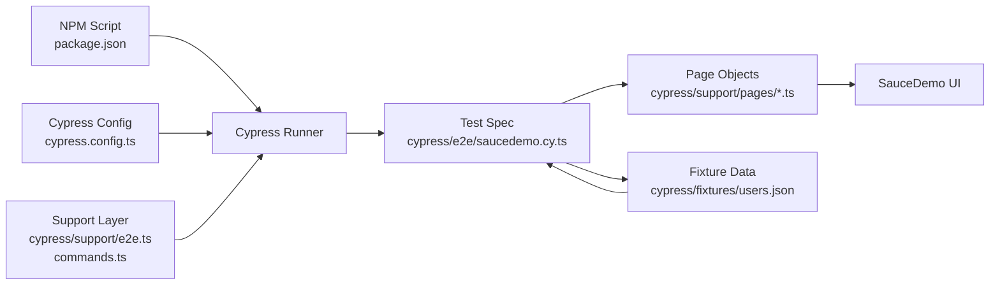

# Cypress E2E Framework

A stable, beginner-friendly Cypress automation framework using TypeScript and Page Object Model (POM), built for SauceDemo.

This project is designed to be easy to install, easy to understand, and easy to extend.

For a detailed file-by-file explanation, see PROJECT_FILE_HELP.md.

## What this framework gives you

- Fast setup with minimal dependencies
- Clean test architecture using Page Object Model
- Data-driven tests using JSON fixtures
- Smoke and regression coverage in one spec
- Multiple run modes: headless, headed, Chrome, Edge
- TypeScript support for better editor help and maintainability

## Why this framework is useful

Compared to heavy frameworks with many plugins, this version keeps only what is required for reliable execution.

Advantages:

- Lower setup failure rate
- Fewer moving parts to debug
- Easier onboarding for new QA engineers
- Cleaner separation of test flow and page locators/actions
- Better long-term maintenance and readability

## Complete project structure and file purpose

```text
Cypress_E2E_Framework_May2026
├── clean-install.bat
├── clean-install.ps1
├── cypress.config.ts
├── package.json
├── README.md
├── tsconfig.json
├── cypress/
│   ├── e2e/
│   │   └── saucedemo.cy.ts
│   ├── fixtures/
│   │   └── users.json
│   ├── reports/
│   │   ├── screenshots/
│   │   └── videos/
│   └── support/
│       ├── commands.ts
│       ├── e2e.ts
│       └── pages/
│           ├── CartPage.ts
│           ├── CheckoutPage.ts
│           ├── InventoryPage.ts
│           └── LoginPage.ts
└── scripts/
	└── clean.js
```

Root files:

- clean-install.bat: Windows batch helper for quick clean reinstall (node_modules, lock cleanup, reinstall).
- clean-install.ps1: PowerShell version of clean reinstall helper.
- cypress.config.ts: Main Cypress configuration (baseUrl, timeouts, spec pattern, folders, retries).
- package.json: Project metadata, dependencies, and all npm test scripts.
- README.md: Project documentation and setup guide.
- tsconfig.json: TypeScript compiler settings used by Cypress TypeScript files.

Cypress folders:

- cypress/e2e/saucedemo.cy.ts: Main test spec containing smoke and regression scenarios.
- cypress/fixtures/users.json: Test data source (credentials, checkout values, product data).
- cypress/reports/screenshots: Stores screenshots on failures (if captured).
- cypress/reports/videos: Stores execution videos when video is enabled.
- cypress/support/commands.ts: Place for reusable custom Cypress commands.
- cypress/support/e2e.ts: Runs before every spec; global support entrypoint.
- cypress/support/pages/LoginPage.ts: Login page actions/selectors (open page, enter credentials, submit).
- cypress/support/pages/InventoryPage.ts: Inventory/product page actions (add to cart, validations).
- cypress/support/pages/CartPage.ts: Cart actions and assertions.
- cypress/support/pages/CheckoutPage.ts: Checkout steps, form filling, and completion assertions.

Utility scripts:

- scripts/clean.js: Node cleanup helper used by npm clean command.

## How the framework works

1. Test data is read from fixture JSON.
2. Test spec calls page object methods instead of raw selectors.
3. Page objects contain UI selectors and user actions.
4. Cypress config controls runtime behavior (timeouts, retries, folders).
5. npm scripts provide simple execution commands for each mode.

This keeps tests readable, for example: login -> add to cart -> checkout, without cluttering test files with locator details.

## Architecture flow (quick visual)



How to read this diagram:

1. You run an npm script, which starts Cypress.
2. Cypress loads config and support files.
3. The spec file drives the business test flow.
4. The spec uses page objects for UI actions and assertions.
5. Fixture JSON provides test inputs (users and checkout data).
6. Page objects interact with SauceDemo pages in the browser.

## Prerequisites

Install:

1. Node.js LTS
2. VS Code
3. Google Chrome (recommended)
4. Microsoft Edge (optional)

Check your environment:

```bash
node -v
npm -v
```

## New user setup (step-by-step)

1. Open terminal in project root.
2. Install dependencies:

```bash
npm install
```

3. Run tests in headed Chrome (recommended on Windows):

```bash
npm run open
```

If installation gets corrupted or packages mismatch, run clean reinstall:

```bash
npm run clean
npm install
```

## Run commands and when to use them

Run all tests headless (CI-friendly):

```bash
npm test
```

Run all tests headed (visible browser):

```bash
npm run test:headed
```

Run all tests in Chrome:

```bash
npm run test:chrome
```

Run all tests in Edge:

```bash
npm run test:edge
```

Run only smoke suite:

```bash
npm run test:smoke
```

Run smoke suite in headed Chrome:

```bash
npm run test:smoke -- --headed --browser chrome
```

Run regression suite:

```bash
npm run test:regression
```

Open generated HTML report:

```bash
npm run report:open
```

Open Cypress launcher app (optional):

```bash
npm run open:app
```

Note: On some Windows systems the launcher window may open blank due to Electron rendering issues. Use npm run open for stable headed Chrome execution.

## HTML report and screenshots

This framework generates a Mochawesome HTML report with:

- test-wise pass/fail remarks
- duration and error details
- linked screenshots for test execution

Report output locations:

- HTML: cypress/reports/html/index.html
- JSON: cypress/reports/html/index.json
- Screenshots: cypress/reports/screenshots

## Test scenarios included

Smoke:

1. Login page display validation
2. Successful login with valid user
3. Login error validation for locked user

Regression:

1. Add product to cart
2. Full purchase journey
3. Checkout empty form validation

## Test data management

Update test values in fixture JSON:

- usernames and passwords
- first name, last name, zip code
- product names

Using fixture data keeps test logic clean and avoids hardcoding in specs.

## Best practices for extending this framework

- Add new page actions inside page classes, not directly in test specs.
- Keep assertions close to business flow in spec files.
- Use fixture data for all input values.
- Keep selectors centralized in page objects.
- Add small reusable helpers in support commands when needed.

## Troubleshooting quick guide

Problem: Cypress launcher opens blank.

Solution:

1. Use npm run open (headed Chrome run).
2. Verify Cypress binary:

```bash
npx cypress verify
```

Problem: Dependencies not working after updates.

Solution:

```bash
npm run clean
npm install
```

Problem: Browser not detected.

Solution:

- Install Chrome and/or Edge.
- Retry with explicit browser command (test:chrome or test:edge).

## Credentials used in demo scenarios

Valid user:

```text
standard_user / secret_sauce
```

Locked user:

```text
locked_out_user / secret_sauce
```

## Summary

This framework is intentionally simple but production-practical: stable execution, clear file ownership, and easy onboarding for new users.

